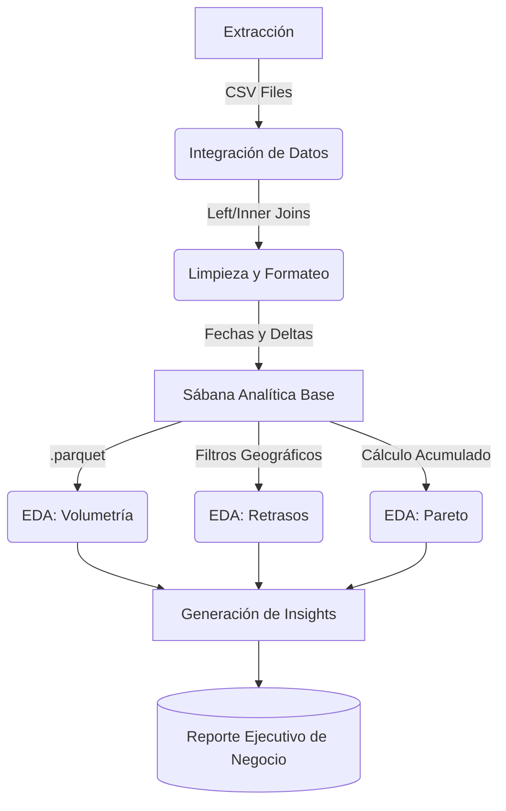

# Logistics Optimization Analytics


## 1. Descripción del Proyecto

Diagnóstico de la cadena de suministro y evaluación del *Service Level Agreement* (SLA) de una red de comercio electrónico en Brasil. El proyecto resuelve la falta de visibilidad sobre la degradación de la experiencia del cliente al integrar y estructurar datos dispersos, identificando de manera programática las fallas logísticas, los picos de demanda y los cuellos de botella geográficos.

> [!IMPORTANT]
> Los datos crudos superan los límites de tamaño para repositorios estándar y contienen información sensible ofuscada, por lo que han sido excluidos mediante `.gitignore`. Para replicar este entorno, es necesario descargar el conjunto de datos "Brazilian E-Commerce Public Dataset by Olist" y depositar los archivos CSV en el directorio `data/raw/`.

## 2. Impacto Analítico

*   **Identificación de ineficiencias de enrutamiento:** Se diagnosticaron los cuellos de botella geográficos de la red logística, aislando 3 estados críticos en la Región Norte que acumulan demoras promedio de hasta 96 días, mediante la extracción de deltas temporales y filtros lógicos iterativos en Pandas.
*   **Aislamiento de la causa raíz de insatisfacción:** Se descubrió el principal vector de quejas por servicio, revelando que el 80% de los retrasos logísticos penalizados por el usuario provienen del mal manejo de bienes voluminosos, aplicando el principio analítico de Pareto a través del modelado de gráficos de doble eje con Plotly.
*   **Mapeo de la capacidad operativa:** Se definió la estacionalidad transaccional de la infraestructura logística, detectando una concentración masiva de operaciones en el tercer trimestre del año, a través de la estructuración de series temporales y normalización de fechas.

## 3. Stack Tecnológico

| Herramienta | Versión | Función en la Arquitectura |
| :--- | :--- | :--- |
| **Python** | 3.10+ | Lenguaje base para el desarrollo del script y la lógica de programación. |
| **Pandas** | 2.0+ | Ingesta de datos multiorigen, *Joins* relacionales, limpieza y agregaciones matriciales. |
| **Plotly** | 5.10+ | Renderizado de visualizaciones analíticas interactivas e infografías estáticas. |
| **Jupyter** | Core | Entorno de desarrollo interactivo para el *Exploratory Data Analysis* (EDA). |

## 4. Estructura del Proyecto

```text
ecommerce-logistics-analytics/
├── data/
│   ├── processed/
│   │   └── ecommerce_analytical_base.parquet
│   └── raw/
│       ├── olist_customers_dataset.csv
│       ├── olist_order_items_dataset.csv
│       ├── olist_order_reviews_dataset.csv
│       ├── olist_orders_dataset.csv
│       ├── olist_products_dataset.csv
│       └── product_category_name_translation.csv
├── notebooks/
│   ├── 01_exploracion.ipynb
│   └── 02_analisis_visual.ipynb
├── src/
│   └── graphs/
│       ├── bar_chart_seasonality.png
│       ├── hbar_chart_state_delay.png
│       ├── line_chart_trend.png
│       └── pareto_chart.png
├── venv/                   
├── .gitignore              
├── requirements.txt        
├── report.md               
└── README.md               

```

## 5. Flujo de Operación

El diseño de la solución sigue una arquitectura analítica secuencial para transformar registros transaccionales sin procesar en decisiones de negocio:



1. **Ingesta e Integración:** Lectura de 6 tablas relacionales distintas combinadas mediante llaves primarias (`order_id`, `customer_id`, `product_id`).
2. **Transformación:** Conversión estricta de tipos de datos, derivación de nuevas métricas de rendimiento (ej. días de retraso) y clasificación binaria de reseñas (positivas/negativas).
3. **Análisis Visual:** Ejecución de consultas de agrupación en un Notebook aislado para generar trazabilidad gráfica.
4. **Generación de Valor:** Exportación de gráficos estáticos para la construcción de reportes de negocio.

## 6. Documentación y Reportes de Negocio

El código de este repositorio alimenta de manera directa las conclusiones ejecutivas. Para consultar la interpretación de negocio de estos datos, los hallazgos detallados, los gráficos resultantes y las recomendaciones estratégicas propuestas a nivel corporativo, consulte el documento anexo:

* [Reporte Ejecutivo de Optimización Logística y Experiencia del Cliente](report.md)

* [Interactive Notebook available on Kaggle](https://www.kaggle.com/code/juanclopezdec/logistics-bottleneck-diagnosis-olist-e-commerce)
---

## Autores

* **Juan Carlos López** - [JuanEnC](http://github.com/JuanEnC)
