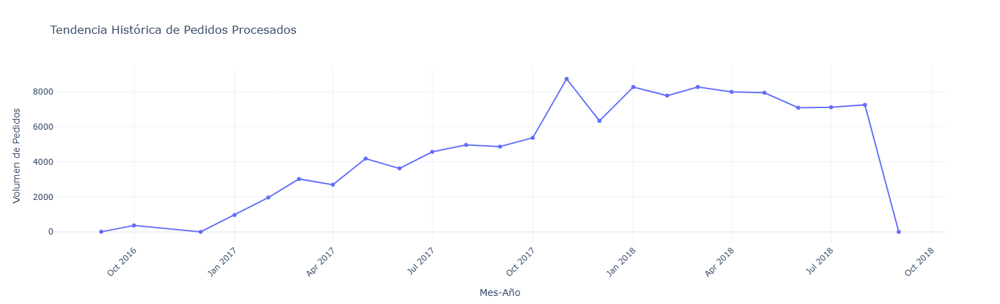
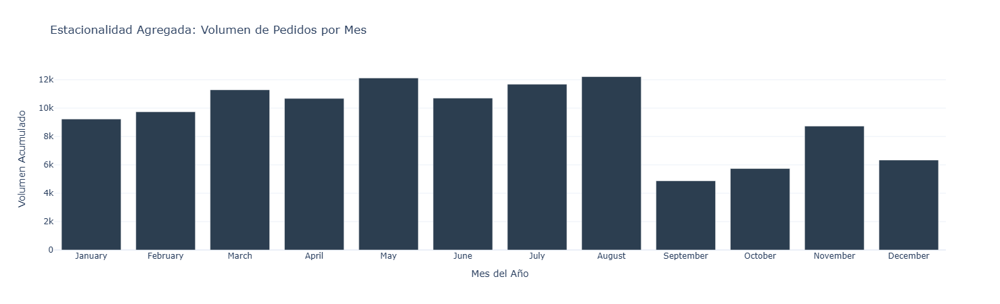
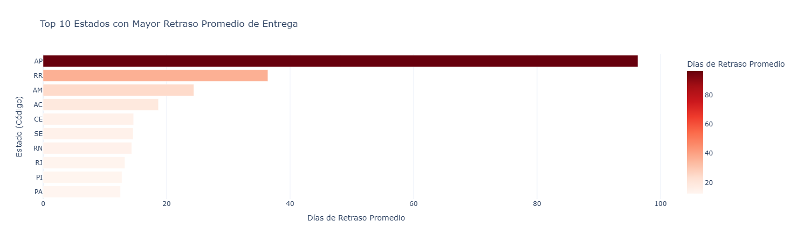
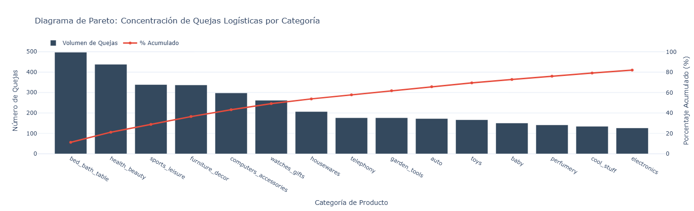

# Reporte de Optimización Logística y Experiencia del Cliente

## 1. Contexto y Objetivo Ejecutivo

Durante el último trimestre analizado (Q3 2018), se detectó una contracción atípica en el volumen de procesamiento de órdenes, acompañada de un incremento en la tasa de insatisfacción del cliente vinculada directamente a las promesas de entrega.

El **objetivo principal** de este diagnóstico es identificar los cuellos de botella geográficos y operativos que impactan el *Service Level Agreement* (SLA) de entregas, con el fin de proponer eficiencias estratégicas que reduzcan el tiempo de ciclo total y mitiguen la fricción en la experiencia del usuario.

---

## 2. Hallazgos Clave de Volumetría

### A. Tendencia Longitudinal de la Demanda

El análisis histórico muestra un crecimiento sostenido de las operaciones comerciales durante 2017, alcanzando un pico máximo de transacciones en noviembre (impulsado por eventos macroeconómicos como el *Black Friday*). Sin embargo, durante 2018, la curva de crecimiento se aplanó, mostrando una ligera tendencia a la baja hacia el final del periodo de captura de datos. Esta estandarización de la demanda sugiere una transición de una fase de hipercrecimiento a una de madurez, donde la retención de clientes mediante un servicio logístico impecable se vuelve crítica.

### B. Estacionalidad y Ciclos de Venta

La agregación de la volumetría por meses revela una fuerte estacionalidad. Los meses de mayor carga operativa son mayo, julio y agosto. Esta concentración exige una planificación de capacidad (*Capacity Planning*) dinámica, ya que mantener una infraestructura logística plana durante todo el año genera sobrecostos en temporada baja y saturación de la red de transporte en temporada alta.

---

## 3. Diagnóstico de Fricción Logística por Región

La segmentación del rendimiento de entrega por estado expone un patrón geográfico crítico que devalúa la experiencia del cliente. Los estados con mayores demoras respecto a la fecha estimada de entrega son:

* **Amapá (AP):** Deficiencia crítica, con un promedio de 96 días de retraso.
* **Roraima (RR):** Demora promedio de 36 días.
* **Amazonas (AM):** Demora promedio de 24 días.

Existe una correlación directa con la Región Norte de Brasil, una zona geográficamente compleja con infraestructura de transporte limitada. Actualmente, el algoritmo de estimación de fechas de entrega está fallando al no contemplar estas variables geográficas, generando falsas expectativas en el cliente.

---

## 4. Análisis de Causas Raíz (Principio de Pareto)

Al cruzar los datos de envíos retrasados con las calificaciones negativas de los clientes (puntuaciones 1 y 2), la distribución no es uniforme.

El Diagrama de Pareto demuestra que una pequeña fracción del catálogo concentra la mayoría de las quejas logísticas. Categorías como *Bed_Bath_Table* (Cama, Mesa y Baño), *Furniture_Decor* (Muebles y Decoración) y *Health_Beauty* lideran la lista. Al auditar estas categorías, se deduce que predominan los **bienes voluminosos, pesados o frágiles**. Esto indica que los *carriers* (transportistas) actuales son ineficientes procesando carga no estandarizada o de gran formato.

---

## 5. Conclusión y Recomendaciones Estratégicas

El decremento en la retención y satisfacción no es un problema generalizado del catálogo, sino una deficiencia localizada en el modelo de distribución. Para resolver estos cuellos de botella, se proponen las siguientes acciones inmediatas:

1. **Calibración del Algoritmo de Estimación (ETA):** Modificar la lógica de predicción de entrega en el *checkout* para sumar un margen de holgura de entre 15 y 30 días exclusivamente para códigos postales pertenecientes a la Región Norte (AP, RR, AM). Es preferible prometer un tiempo largo y cumplirlo, que prometer un tiempo corto y fallar.
2. **Licitación de Transportistas Especializados:** Revisar los contratos de nivel de servicio (SLA) con los proveedores logísticos para las categorías voluminosas (Muebles, Cama/Baño). Se requiere contratar transportistas especializados en *Heavy Bulky Goods* para estas verticales de producto.
3. **Implementación de Alertas Preventivas (Pipeline de Datos):** Desarrollar un modelo predictivo que evalúe diariamente las órdenes en tránsito y dispare una alerta automática al equipo de Servicio al Cliente cuando un paquete voluminoso dirigido a la Región Norte supere el 80% de su tiempo estimado, permitiendo un contacto proactivo con el comprador antes de que se genere la queja.
